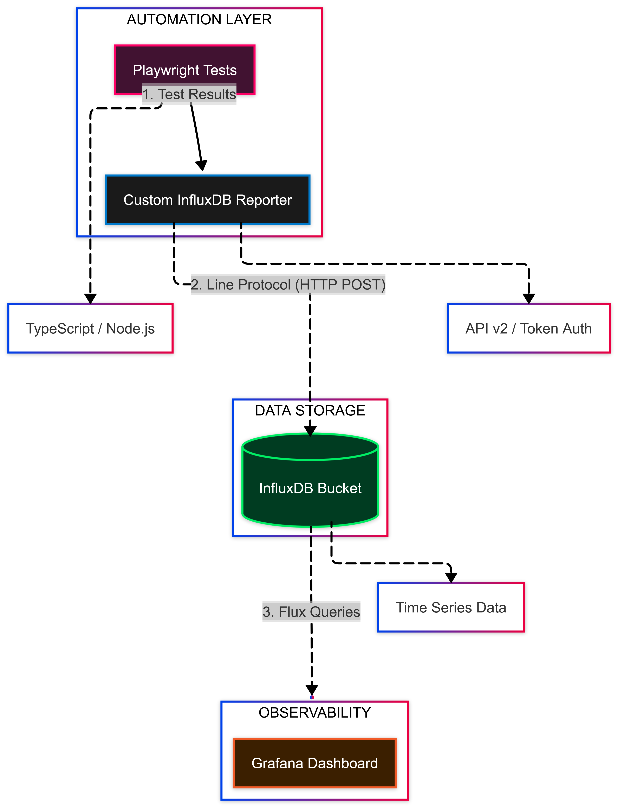
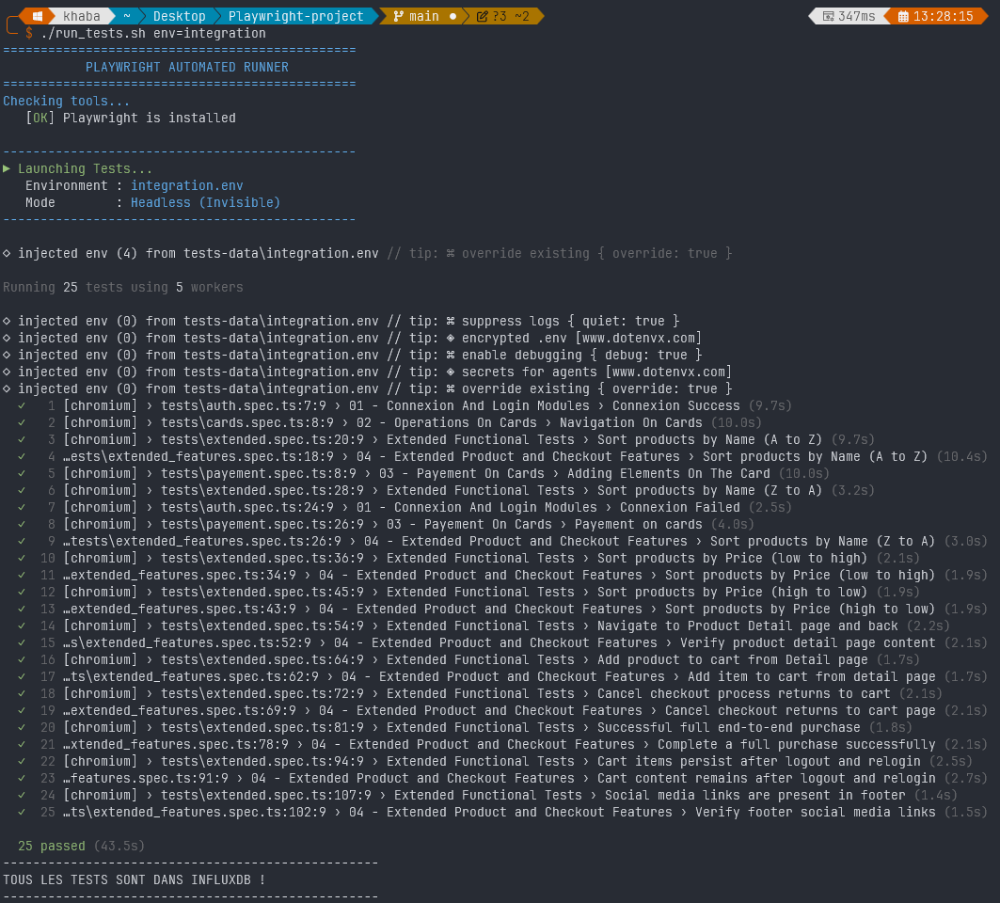
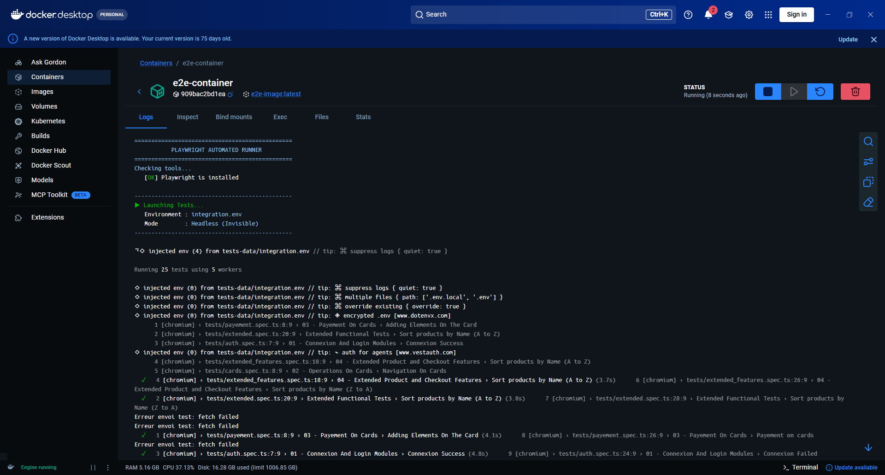

# Playwright monitoring architecture

The objective of this project is to develop a solid automated testing architecture with scalable and maintainable aspects, leading to a monitoring design. This project contains some automated tests (for testing purposes), but the main objective is the monitoring aspect.

## Automation architecture process
The primary goal is to build a robust, four-layer architecture that transitions from execution to high-level visibility. This structure decouples the test logic from the reporting, ensuring the system is both scalable and maintainable.

### The Four-Layer Architecture :
* **Automation Core Engine**: The foundation of the stack. This is the execution engine responsible for running the test scripts. It handles the test logic, assertions, and driver management.

* **Virtualization & Orchestration Layer**: This layer manages the environment using Docker containers. It orchestrates the communication between different services (e.g., Selenium Grid nodes, databases, and the app under test), ensuring a consistent and isolated execution environment.

* **Metrics & Data Processing Layer**: Once the engine executes the tests, this layer acts as the pipeline. It fetches, reorganizes, and parses raw results (like JUnit XML or JSON) and stores them in a time-series database or structured storage. This ensures the data is in a format optimized for monitoring tools.

* **Monitoring & Visualization Layer**: The final interface for stakeholders. Instead of digging through messy CI/CD logs, QA engineers and managers use dashboards (e.g., Grafana or Kibana) to visualize pass/fail rates, trends, and performance metrics in real-time.

### Value Proposition :
This architecture addresses a common industry pain point: the need for high-level quality insights versus granular debugging. By separating these concerns, you can monitor project progress and quality health at a glance, while still retaining the ability to expose detailed logs within the monitoring tool when a deep dive is required.



## end to end tests architecture
this project use playwright basic project, containing the files to test, but we will add some modification to the project to make it more :
```javascript
├───.dockerignore  // to ignore docker copy command
│   .gitignore
│   docker-compose.yml // docker compose (I will explain it later)
│   dockerfile // Docker image to run auto tests 
│   playwright.config.ts // Configuration of playwright engine (we need to see it later)
│   run_tests.sh // A custom script shell to execute auto tests
├───.github
│   └───workflows
│           playwright.yml // CI/CD configuration
├───playwright-report/
├───test-results/
├───tests
│       auth.spec.ts
│       cards.spec.ts
│       extended.spec.ts
│       extended_features.spec.ts
│       payement.spec.ts
├───tests-data // Envs of tests
│       integration.env
│       preprod.env
|       integration.example.env // A template of Env variables
└───utils
    │   influx-reporter.ts // COnfiguration file for Influx DB metrics
    │   locators.ts
    │
    ├───general
    │       login.ts
    └───navigation
            payement.ts
            product.ts
```
### Running auto tests
To run the automated tests, you must first configure the environment variables required for the specific target environment. These variables should be defined in a file located at `tests-data/integration.env`.
A template for this file is provided at `tests-data/integration.example.env`:

```yaml
ADMIN_USER_NAME=
ADMIN_PASSWORD=
BASE_URL=
INFLUX_TOKEN=
```
#### Running auto tests locally
to run auto tests locally after the configuration of the env file, we just need to run the script shell :
```bash
./run_tests.sh env=integration
```


#### Running auto tests inside docker
To run auto tests insode a docker container, we will use the docker file, first we build the docker image and then we run the container : 
```bash
docker build -t e2e-image .
docker run -it -d --name=e2e-container e2e-image
```
